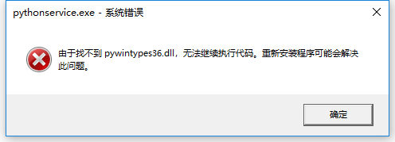

# Flask Celery SocketIO Demo

A demo using flask socketio in celery task.

## Install

1. Install RabbitMQ
2. `pipenv install`

```
# Windows don't support celery 4+, so install celery==3.1.25
pipenv install flask flask_socketio celery==3.1.25
```

## Start Run

```
# console 1:
celery worker -A celery_app.celery --loglevel=info

# console 2:
python flask_app.py
```

## Celery注册为Window服务步骤

1. Require install `pywin32`
2. Copy `Lib\site-packages\pywin32_system32\pywintypes36.dll` to `Lib\site-packages\win32`
3. `python celery_service.py install`

### Usage

```
python celery_service.py [ install | start | stop | remove | debug ]
```

## Celery注册为Service出现异常的解决方法

- Windows 10 x64
- Python 3.6 x64

### 服务没有及时响应启动或控制请求

开启服务的时候会出现报错“The service did not respond to the start or control request in a timely fashion”，意思是“服务没有及时响应启动或控制请求”。

解决方案：

可能是pythonservice.exe无法启动，参见下面的解决方案。

### pythonservice.exe无法启动的问题

在资源浏览器中双击启动pythonservice.exe，弹出：



解决方案：

在python的安装目录下`Lib\site-packages\pywin32_system32`，会发现有两个文件：

- pythoncom36.dll
- pywintypes36.dll

将这`pywintypes36.dll`拷贝到`Lib\site-packages\win32`目录即可。 
